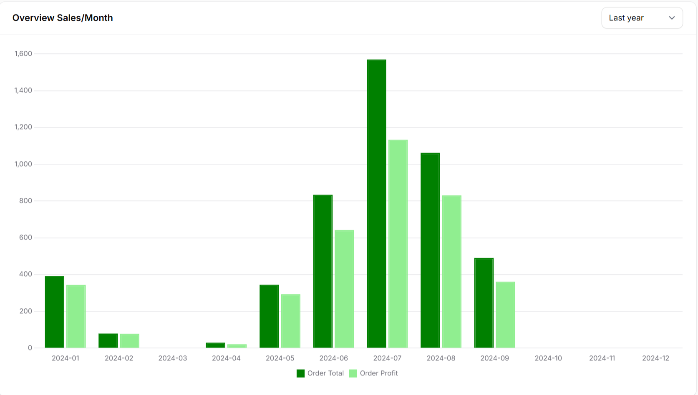

---
tags:
     - HTML5
     - CSS
---

## Introduction
[Hover me](https://example.com "I'm a tooltip!")


| Method      | Description                          |
| ----------- | ------------------------------------ |
| `GET`       | :material-check:     Fetch resource  |
| `PUT`       | :material-check-all: Update resource |
| `DELETE`    | :material-close:     Delete resource |


Enim :smile: reprehenderit qui ea proident ex duis minim deserunt nostrud consequat eiusmod mollit. Magna fugiat magna nostrud consequat officia cupidatat commodo eu aute laborum. Reprehenderit et magna duis occaecat aliquip sint anim enim ullamco do ipsum eu nostrud. Cupidatat pariatur consequat magna voluptate ex quis non magna. Dolor dolore officia qui nostrud sint labore id ex cillum labore. Laboris elit ex qui ullamco cillum culpa. Sit ullamco aliquip id elit ea pariatur.

Lorem ipsum dolor sit amet, (1) consectetur adipiscing elit.
{ .annotate }

1.  :man_raising_hand: I'm an annotation! I can contain `code`, __formatted
    text__, images, ... basically anything that can be expressed in Markdown.

[Subscribe to our newsletter](#){ .md-button .md-button--primary }
### Section 1

> sdfgsdgsdfgsdfgsdfg

---

{width="200" align="right"}
/// caption
Figure 2a: adfadfsasf
///

Sint labore Lorem aliqua enim nisi sint minim sint voluptate commodo aute incididunt amet. Nostrud duis nisi officia ut ex laboris irure. **Sit cillum** dolore tempor nostrud tempor. Sunt amet dolor irure ea anim eu ullamco *ipsum Lorem* anim et occaecat qui.

```html
<!DOCTYPE html>
<html>
<body>

<h1>My First Heading</h1>
<p>My first paragraph.</p>

</body>
</html>
```

```PY
import tensorflow as tf
```

### Section 2

<figure markdown="span">
  { width="500" }
  <figcaption>Image caption</figcaption>
</figure>
Deserunt voluptate est non ipsum enim ullamco esse exercitation nulla nostrud consectetur cillum. Laboris voluptate dolor et cillum anim eiusmod nostrud cupidatat anim pariatur veniam deserunt consectetur. Qui proident eiusmod ad commodo incididunt enim culpa. Dolore id nulla pariatur sint.

### Section 3

{ width="500" align="right"}
/// caption
Figure 3a: adfadfsasf
///
Ex officia pariatur aliquip ipsum laboris magna officia magna deserunt voluptate ut. Dolor culpa proident elit in incididunt aliquip laborum. Eiusmod ad ipsum Lorem dolor voluptate irure adipisicing anim sit adipisicing qui minim exercitation amet. Irure minim veniam veniam laboris cillum non officia enim cupidatat sunt. Quis reprehenderit est eu laboris eiusmod eiusmod. Ea nisi ea ex amet.

