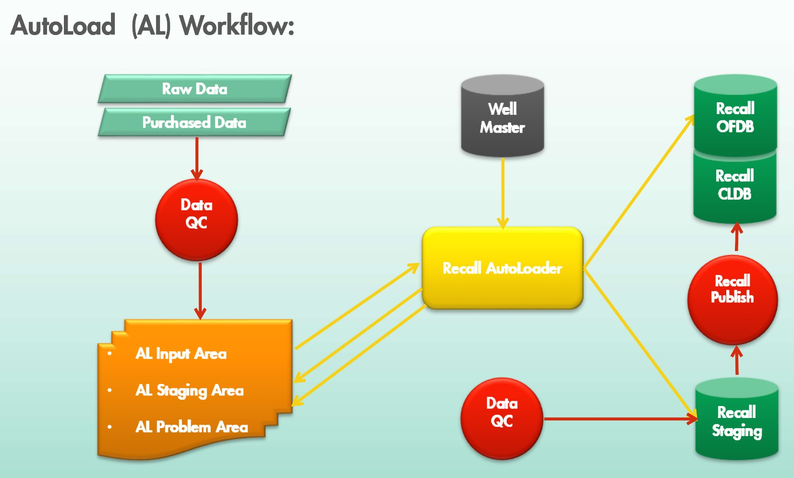

# **Recall Autoloader** (AL)

## **What are Recall Drop Boxes**
- RECALL Drop Boxes are basically Linux directories dedicated to data loading.​
- Users can drop (copy) data files in these directories.​
- The RECALL ‘Autoload’ module will check these directories every 5 minutes for data files to be loaded into Recall STDB (Staging Database).​
- When ‘Autoload’ find files in a drop box,  these files will be loaded fully automated into the  RECALL Staging database by ‘Autoload’.​
-‘Autoload’ loading methods will be determine by the file extensions.

## **Features**
- Prepass/load of data source files (Tapes/Films/Wellfiles/Logfiles) into Recall STDB.​
- Direct loading into OFDB/CLDB database supported (not recommended).​
- Well matching with AL/CDS.​
- Supported tape image files:​
    - DLIS, DLS, LIS, LAS and XML (WITSML)​
- Supported film image files:​
    - PDS, PDF, TIF, META, GDF, RAS, EMF, WMF, XWD, JPG, BMP, GIF, CGM​
- Support well files:​
    - DOC, TXT, XLS, PPT, SEGY, SEG, HTML, ZIP​
- Not supported files: PPTX, XLSX, DOCX​
- Email notification.
---
## **Autoload (AL) Workflow**

<!-- test_mkdocs\docs\recall_training\AL_workflow.jpg -->
---
## **Setup**

- $RECALL_DATA/al/inp​
    - This is the AutoLoad input area for data files to be loaded.​ Here are the Shell OU defined ‘dop boxes’.​
- ​$RECALL_DATA/al/arc​
    - Area where AutoLoad will move processed data files.​
- $RECALL_DATA/var/al/log​
    - These are the directories containing the data loading log files.​
​

